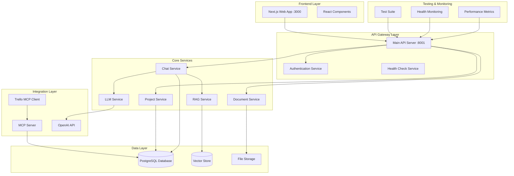

# Design Document

## Overview

This design addresses the comprehensive analysis and remediation of the StudioOps AI application. Based on the codebase analysis, several critical issues have been identified:

1. **Multiple API entry points** with inconsistent functionality (main.py, simple_main.py, minimal_api.py)
2. **Database connection issues** and missing initialization
3. **Incomplete AI service integration** with OpenAI and RAG systems
4. **Missing Trello MCP implementation** (empty trello-mcp directory)
5. **Inconsistent error handling** across services
6. **Missing comprehensive testing** for critical workflows
7. **Frontend-backend communication issues** with different port configurations

The solution involves creating a unified, robust architecture with proper error handling, comprehensive testing, and full feature implementation.

## Architecture

### System Components



### Service Architecture

1. **Unified API Server**: Consolidate multiple API entry points into a single, robust server
2. **Service Layer Pattern**: Separate business logic into dedicated service classes
3. **Repository Pattern**: Abstract database operations for better testability
4. **MCP Integration**: Implement proper MCP server for Trello integration
5. **Health Monitoring**: Comprehensive health checks for all components

## Components and Interfaces

### 1. API Server Consolidation

**Current Issues:**
- Three different API servers (main.py, simple_main.py, minimal_api.py)
- Inconsistent middleware and routing
- Different port configurations causing confusion

**Design Solution:**
```python
class UnifiedAPIServer:
    def __init__(self):
        self.app = FastAPI(title="StudioOps AI API", version="2.0.0")
        self.setup_middleware()
        self.setup_routes()
        self.setup_health_checks()
    
    def setup_middleware(self):
        # CORS, Authentication, Observability, Error Handling
        pass
    
    def setup_routes(self):
        # Consolidated routing with proper error handling
        pass
```

### 2. Database Connection Manager

**Current Issues:**
- Inconsistent connection handling
- No connection pooling
- Missing initialization checks

**Design Solution:**
```python
class DatabaseManager:
    def __init__(self):
        self.connection_pool = None
        self.is_initialized = False
    
    async def initialize(self):
        # Create connection pool, run migrations, verify schema
        pass
    
    async def get_connection(self):
        # Return pooled connection with proper error handling
        pass
    
    async def health_check(self):
        # Verify database connectivity and performance
        pass
```

### 3. AI Services Integration

**Current Issues:**
- LLM service exists but not fully integrated
- RAG service incomplete
- Missing context management

**Design Solution:**
```python
class AIServiceManager:
    def __init__(self):
        self.llm_service = LLMService()
        self.rag_service = RAGService()
        self.context_manager = ContextManager()
    
    async def generate_response(self, message, session_id, project_context):
        # Unified AI response generation with RAG integration
        pass
    
    async def process_document(self, document, project_id):
        # Document processing for RAG system
        pass
```

### 4. MCP Server Implementation

**Current Issues:**
- MCP server exists but Trello integration is incomplete
- Empty trello-mcp directory
- Missing task export functionality

**Design Solution:**
```python
class TrelloMCPServer:
    def __init__(self):
        self.mcp_server = Server("trello-mcp")
        self.trello_client = TrelloClient()
        self.setup_tools()
    
    def setup_tools(self):
        # Create board, add cards, update tasks, sync status
        pass
    
    async def export_tasks_to_trello(self, project_id, tasks):
        # Export project tasks to Trello board
        pass
```

### 5. Testing Framework

**Current Issues:**
- Basic test files exist but incomplete coverage
- No integration test suite
- Missing performance tests

**Design Solution:**
```python
class TestSuite:
    def __init__(self):
        self.unit_tests = UnitTestRunner()
        self.integration_tests = IntegrationTestRunner()
        self.e2e_tests = E2ETestRunner()
        self.performance_tests = PerformanceTestRunner()
    
    async def run_comprehensive_tests(self):
        # Run all test suites with detailed reporting
        pass
```

## Data Models

### Enhanced Project Model
```python
class Project(BaseModel):
    id: str
    name: str
    client_name: Optional[str]
    status: ProjectStatus
    start_date: Optional[datetime]
    due_date: Optional[datetime]
    budget_planned: Optional[float]
    budget_actual: Optional[float]
    description: Optional[str]
    tags: List[str] = []
    ai_context: Optional[Dict[str, Any]]
    trello_board_id: Optional[str]
    created_at: datetime
    updated_at: Optional[datetime]
```

### Chat Session Model
```python
class ChatSession(BaseModel):
    id: str
    project_id: Optional[str]
    user_id: Optional[str]
    title: Optional[str]
    context: Dict[str, Any]
    created_at: datetime
    last_activity: datetime
    message_count: int
    is_active: bool
```

### Document Model
```python
class Document(BaseModel):
    id: str
    project_id: Optional[str]
    title: str
    content: str
    document_type: DocumentType
    source: str
    file_path: Optional[str]
    embeddings: Optional[List[float]]
    metadata: Dict[str, Any]
    created_at: datetime
    updated_at: Optional[datetime]
```

## Error Handling

### Centralized Error Management
```python
class ErrorHandler:
    def __init__(self):
        self.logger = logging.getLogger(__name__)
        self.error_codes = ErrorCodes()
    
    def handle_database_error(self, error: Exception):
        # Standardized database error handling
        pass
    
    def handle_api_error(self, error: Exception):
        # Standardized API error handling
        pass
    
    def handle_integration_error(self, error: Exception):
        # Standardized integration error handling
        pass
```

### Error Response Format
```python
class ErrorResponse(BaseModel):
    error_code: str
    message: str
    details: Optional[Dict[str, Any]]
    timestamp: datetime
    request_id: str
    suggestions: Optional[List[str]]
```

## Testing Strategy

### 1. Unit Tests
- Service layer functions
- Data model validation
- Utility functions
- Error handling scenarios

### 2. Integration Tests
- API endpoint functionality
- Database operations
- External service integrations
- Authentication flows

### 3. End-to-End Tests
- Complete user workflows
- Frontend-backend integration
- Multi-service interactions
- Error recovery scenarios

### 4. Performance Tests
- API response times
- Database query performance
- Memory usage patterns
- Concurrent user handling

### 5. Health Monitoring Tests
- Service availability
- Database connectivity
- External API status
- Resource utilization

## Implementation Phases

### Phase 1: Foundation Stabilization
1. Consolidate API servers into unified server
2. Implement robust database connection management
3. Create comprehensive error handling system
4. Establish health monitoring framework

### Phase 2: Core Service Implementation
1. Complete AI service integration (LLM + RAG)
2. Implement proper session and memory management
3. Create document processing pipeline
4. Establish project management workflows

### Phase 3: Integration Layer
1. Complete MCP server implementation
2. Build Trello integration with task export
3. Implement authentication and authorization
4. Create API documentation and testing tools

### Phase 4: Testing and Optimization
1. Implement comprehensive test suite
2. Performance analysis and optimization
3. Security audit and hardening
4. Documentation and deployment guides

## Security Considerations

1. **API Security**: JWT token validation, rate limiting, input sanitization
2. **Database Security**: Connection encryption, query parameterization, access control
3. **File Security**: Upload validation, virus scanning, access permissions
4. **Integration Security**: API key management, secure credential storage
5. **Monitoring Security**: Audit logging, intrusion detection, alert systems

## Performance Optimization

1. **Database Optimization**: Connection pooling, query optimization, indexing
2. **API Optimization**: Response caching, compression, pagination
3. **AI Service Optimization**: Model caching, batch processing, async operations
4. **Frontend Optimization**: Code splitting, lazy loading, CDN usage
5. **Infrastructure Optimization**: Load balancing, auto-scaling, monitoring