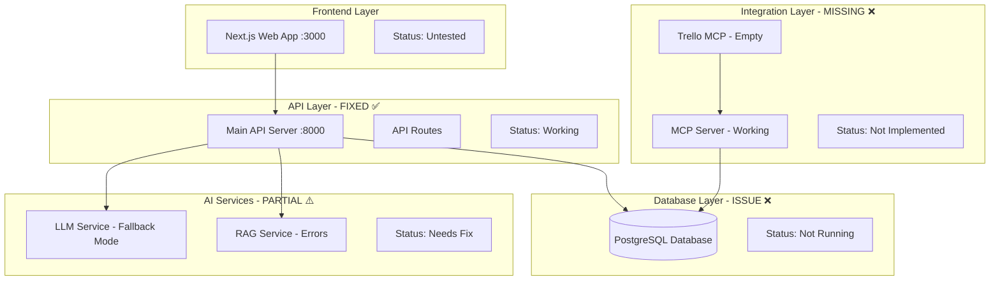

# Critical Connectivity Fixes - Design Document

## Overview

This design addresses the remaining critical issues after successfully fixing API server dependency problems. The focus is on database connectivity, missing Trello integration, RAG system errors, and AI services enablement.

## Current Status

### ✅ Fixed Issues
- API server dependency issues (WeasyPrint, instructor)
- Import and module loading problems
- Server startup and initialization

### 🔧 Remaining Critical Issues
- Database connectivity (PostgreSQL not running)
- Missing Trello MCP implementation
- RAG system duplicate key errors
- OpenAI integration disabled
- Frontend-backend integration untested

## Architecture

### System Components Status



## Component Designs

### 1. Database Connectivity Restoration

**Current Issue**: PostgreSQL container not running, causing all database operations to fail.

**Design Solution**:
```yaml
# Docker Compose Service
postgres:
  image: ankane/pgvector:latest
  container_name: studioops-postgres
  environment:
    POSTGRES_DB: studioops
    POSTGRES_USER: studioops
    POSTGRES_PASSWORD: studioops123
  ports:
    - "5432:5432"
  volumes:
    - postgres_data:/var/lib/postgresql/data
    - ./init.sql:/docker-entrypoint-initdb.d/init.sql
```

**Implementation Steps**:
1. Start Docker Desktop
2. Run `docker-compose up -d postgres`
3. Verify database connectivity
4. Test API endpoints with database operations

### 2. Trello MCP Server Implementation

**Current Issue**: `apps/trello-mcp` directory is completely empty.

**Design Solution**:
```python
# apps/trello-mcp/server.py
from mcp.server import Server
from mcp.types import Tool, TextContent
import requests
import os

class TrelloMCPServer:
    def __init__(self):
        self.server = Server("trello-mcp")
        self.api_key = os.getenv('TRELLO_API_KEY')
        self.token = os.getenv('TRELLO_TOKEN')
        self.base_url = "https://api.trello.com/1"
        self.setup_tools()
    
    def setup_tools(self):
        @self.server.list_tools()
        async def list_tools():
            return [
                Tool(
                    name="create_board",
                    description="Create a new Trello board",
                    inputSchema={
                        "type": "object",
                        "properties": {
                            "name": {"type": "string"},
                            "description": {"type": "string"}
                        },
                        "required": ["name"]
                    }
                ),
                Tool(
                    name="create_card",
                    description="Create a card in a Trello board",
                    inputSchema={
                        "type": "object", 
                        "properties": {
                            "board_id": {"type": "string"},
                            "list_name": {"type": "string"},
                            "name": {"type": "string"},
                            "description": {"type": "string"}
                        },
                        "required": ["board_id", "list_name", "name"]
                    }
                ),
                Tool(
                    name="export_project_tasks",
                    description="Export project tasks to Trello board",
                    inputSchema={
                        "type": "object",
                        "properties": {
                            "project_id": {"type": "string"},
                            "board_name": {"type": "string"}
                        },
                        "required": ["project_id"]
                    }
                )
            ]
    
    async def create_board(self, name: str, description: str = "") -> dict:
        """Create a new Trello board"""
        url = f"{self.base_url}/boards"
        params = {
            "key": self.api_key,
            "token": self.token,
            "name": name,
            "desc": description
        }
        
        response = requests.post(url, params=params)
        response.raise_for_status()
        return response.json()
    
    async def create_card(self, board_id: str, list_name: str, name: str, description: str = "") -> dict:
        """Create a card in a Trello board"""
        # First, get the list ID
        lists_url = f"{self.base_url}/boards/{board_id}/lists"
        lists_params = {"key": self.api_key, "token": self.token}
        
        lists_response = requests.get(lists_url, params=lists_params)
        lists_response.raise_for_status()
        lists = lists_response.json()
        
        # Find the target list
        target_list = next((l for l in lists if l["name"] == list_name), None)
        if not target_list:
            # Create the list if it doesn't exist
            create_list_url = f"{self.base_url}/lists"
            create_list_params = {
                "key": self.api_key,
                "token": self.token,
                "name": list_name,
                "idBoard": board_id
            }
            list_response = requests.post(create_list_url, params=create_list_params)
            list_response.raise_for_status()
            target_list = list_response.json()
        
        # Create the card
        card_url = f"{self.base_url}/cards"
        card_params = {
            "key": self.api_key,
            "token": self.token,
            "name": name,
            "desc": description,
            "idList": target_list["id"]
        }
        
        card_response = requests.post(card_url, params=card_params)
        card_response.raise_for_status()
        return card_response.json()
```

### 3. RAG System Error Resolution

**Current Issue**: Duplicate key violations when initializing RAG documents.

**Design Solution**:
```python
# apps/api/rag_service.py - Enhanced initialization
def _add_initial_documents(self, collection):
    """Add initial knowledge base documents with deduplication"""
    initial_docs = [
        # ... document definitions
    ]
    
    for doc_data in initial_docs:
        # Check if document already exists
        db = next(get_db())
        try:
            existing_doc = db.query(RAGDocument).filter(
                RAGDocument.title == doc_data['title'],
                RAGDocument.source == doc_data['source']
            ).first()
            
            if existing_doc:
                print(f"Document already exists: {doc_data['title']}")
                continue
            
            # Generate embedding
            embedding = self.embedding_model.encode(doc_data['content']).tolist()
            
            # Generate unique ID
            doc_id = str(uuid.uuid4())
            
            # Add to ChromaDB
            collection.add(
                ids=[doc_id],
                embeddings=[embedding],
                documents=[doc_data['content']],
                metadatas=[{
                    'title': doc_data['title'],
                    'source': doc_data['source'],
                    'type': doc_data['type']
                }]
            )
            
            # Save to database
            rag_doc = RAGDocument(
                id=doc_id,
                title=doc_data['title'],
                content=doc_data['content'],
                source=doc_data['source'],
                document_type=doc_data['type'],
                embedding=embedding
            )
            db.add(rag_doc)
            db.commit()
            print(f"Added new document: {doc_data['title']}")
            
        except Exception as e:
            db.rollback()
            print(f"Error processing document {doc_data['title']}: {e}")
        finally:
            db.close()
```

### 4. OpenAI Integration Enablement

**Current Issue**: LLM service using fallback mode instead of real OpenAI API.

**Design Solution**:
```python
# apps/api/llm_service.py - Enable OpenAI
class LLMService:
    def __init__(self):
        self.api_key = os.getenv('OPENAI_API_KEY')
        
        if self.api_key and self.api_key.startswith('sk-'):
            try:
                self.client = OpenAI(api_key=self.api_key)
                self.model = os.getenv('OPENAI_MODEL', 'gpt-3.5-turbo')
                self.use_openai = True
                print("OpenAI integration enabled")
            except Exception as e:
                print(f"OpenAI client initialization failed: {e}")
                self.client = None
                self.use_openai = False
                print("Using fallback LLM responses")
        else:
            print("OpenAI API key not configured - using fallback responses")
            self.client = None
            self.use_openai = False
```

### 5. Frontend Integration Testing

**Current Issue**: Frontend-backend integration untested after fixes.

**Design Solution**:
```typescript
// apps/web/src/lib/api.ts - Enhanced error handling
export async function checkConnection(): Promise<boolean> {
  try {
    const response = await fetch(`${API_BASE_URL}/health`, {
      method: 'GET',
      headers: {
        'Content-Type': 'application/json',
      },
    });
    return response.ok;
  } catch (error) {
    console.error('API connection check failed:', error);
    return false;
  }
}

// Enhanced project API with better error handling
export const projectsApi = {
  getAll: async () => {
    try {
      return await apiGet<any[]>('/projects');
    } catch (error) {
      console.error('Failed to fetch projects:', error);
      throw error;
    }
  },
  create: async (data: any) => {
    try {
      return await apiPost<any>('/projects', data);
    } catch (error) {
      console.error('Failed to create project:', error);
      throw error;
    }
  }
};
```

## Implementation Strategy

### Phase 1: Database Restoration (Priority 1)
1. Start Docker Desktop and PostgreSQL container
2. Verify database connectivity
3. Test all API endpoints with database operations
4. Validate project CRUD operations

### Phase 2: Trello MCP Implementation (Priority 2)
1. Create basic MCP server structure
2. Implement Trello API integration
3. Add task export functionality
4. Test with real Trello credentials

### Phase 3: AI Services Enhancement (Priority 3)
1. Fix RAG system initialization errors
2. Enable OpenAI integration
3. Test chat functionality end-to-end
4. Validate conversation memory

### Phase 4: Integration Testing (Priority 4)
1. Test frontend-backend connectivity
2. Validate complete user workflows
3. Test error handling and recovery
4. Performance and reliability testing

## Success Metrics

- Database connectivity: 100% of API endpoints working
- Trello integration: Basic task export functional
- RAG system: Error-free initialization and document processing
- OpenAI integration: Real AI responses in chat
- Frontend integration: Complete project management workflow working
- End-to-end testing: All critical user journeys functional