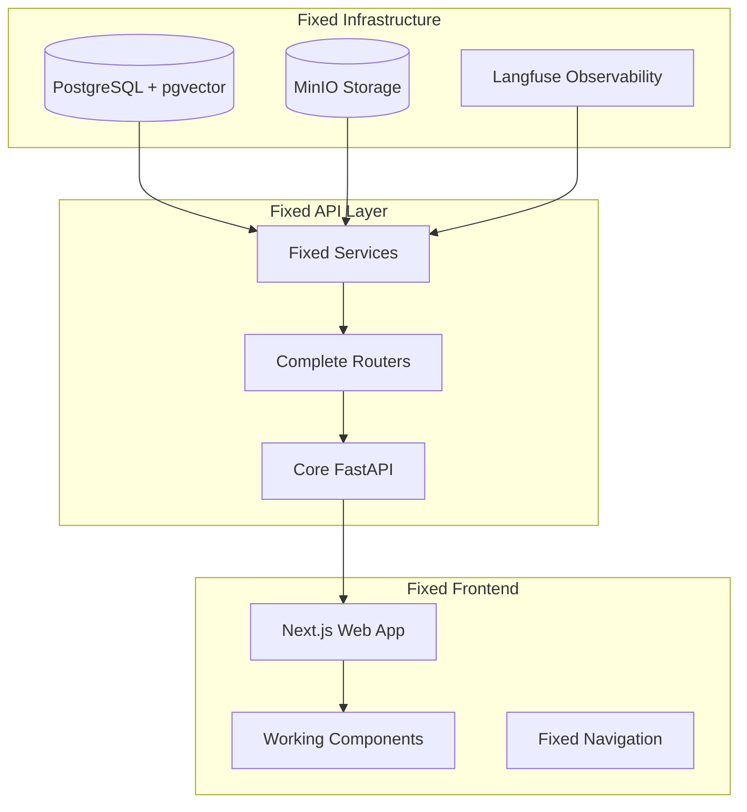

# StudioOps AI Bug Fixes - Design Document

## Overview

This design document outlines the systematic approach to fix all critical issues in the StudioOps AI codebase. The fixes are organized into phases that build upon each other, ensuring a stable foundation before adding complex features.

## Architecture

The system follows a hybrid architecture with local data/compute plane and cloud control plane:

## Components

### 1. Infrastructure Foundation

**Problem:** Docker services not starting, database connections failing, missing health checks.

**Solution:**
- Fix Docker Compose configuration with proper service dependencies
- Add health checks for all services with appropriate timeouts
- Ensure proper network configuration and port mapping
- Add volume persistence for data services
- Create initialization scripts for database setup

**Key Changes:**
- Update `infra/docker-compose.yml` with health checks and dependencies
- Fix database initialization with proper extensions
- Add MinIO bucket creation and Langfuse setup
- Create proper environment variable templates

### 2. Database Schema Consistency

**Problem:** Models don't match actual database schema, missing migrations, broken relationships.

**Solution:**
- Create comprehensive Alembic migrations from current models
- Fix column name mismatches (e.g., `item_metadata` vs `metadata`)
- Add proper foreign key constraints and indexes
- Ensure all required extensions are installed
- Create seed data that matches the schema

**Key Changes:**
- Generate initial migration from `models.py`
- Fix naming inconsistencies in model definitions
- Add proper indexes for performance
- Create comprehensive seed data script

### 3. Service Layer Reliability

**Problem:** Import errors, missing dependencies, poor error handling, database connection issues.

**Solution:**
- Fix all import paths and circular dependencies
- Add proper error handling with graceful fallbacks
- Implement connection pooling and retry logic
- Add comprehensive logging and observability
- Create mock services for testing without external dependencies

**Key Changes:**
- Fix import statements in all service files
- Add database connection error handling
- Implement fallback mechanisms for external services
- Add proper logging configuration

### 4. API Completeness

**Problem:** Missing endpoints, incomplete routers, schema mismatches, broken request/response handling.

**Solution:**
- Implement all missing API endpoints from the TDD specification
- Fix request/response schema validation
- Add proper error handling and status codes
- Implement streaming endpoints for chat functionality
- Add comprehensive API documentation

**Key Changes:**
- Complete all router implementations
- Fix Pydantic schema definitions
- Add missing endpoints for plans, documents, tasks
- Implement proper SSE for chat streaming

### 5. Frontend Functionality

**Problem:** Missing components, broken navigation, incomplete workflows, non-functional UI elements.

**Solution:**
- Implement all missing React components
- Fix navigation and routing issues
- Add proper state management for complex workflows
- Implement real-time updates and streaming
- Add proper error handling and loading states

**Key Changes:**
- Create missing components (PlanEditor, Chat, Documents, Tasks)
- Fix routing and navigation
- Add proper API integration
- Implement Hebrew RTL support

### 6. Data Flow Integration

**Problem:** Broken communication between components, inconsistent data, missing context propagation.

**Solution:**
- Implement proper data flow between chat → plan → documents → tasks
- Add context management for conversations and projects
- Ensure data consistency across all operations
- Add proper state synchronization
- Implement real-time updates where needed

**Key Changes:**
- Fix chat context propagation to plan generation
- Implement proper project data flow
- Add real-time synchronization
- Fix data consistency issues

### 7. Document Processing Pipeline

**Problem:** Missing ingestion service, no document parsing, broken extraction pipeline.

**Solution:**
- Implement complete document ingestion pipeline
- Add OCR and parsing capabilities
- Create extraction service with LLM integration
- Add clarification workflow for ambiguous data
- Implement proper file storage and retrieval

**Key Changes:**
- Create ingestion service with proper pipeline stages
- Add OCR integration (Tesseract/Unstructured)
- Implement LLM-based extraction
- Add clarification UI workflow

### 8. Observability and Monitoring

**Problem:** Broken Langfuse integration, missing traces, poor error logging, no health monitoring.

**Solution:**
- Fix Langfuse client initialization and API usage
- Add comprehensive tracing for all operations
- Implement proper error tracking and alerting
- Add health check endpoints for all services
- Create monitoring dashboards

**Key Changes:**
- Fix observability service implementation
- Add tracing to all critical operations
- Implement proper error tracking
- Add comprehensive health checks

### 9. Configuration Management

**Problem:** Missing environment variables, hardcoded values, poor default handling.

**Solution:**
- Create comprehensive environment configuration
- Add proper default values and validation
- Implement configuration validation at startup
- Add environment-specific configurations
- Create proper secrets management

**Key Changes:**
- Create complete `.env.example` files
- Add configuration validation
- Implement proper defaults
- Add environment-specific overrides

### 10. Hebrew Language Support

**Problem:** Missing RTL support, no Hebrew fonts, incorrect currency formatting.

**Solution:**
- Implement proper RTL layout in React components
- Add Hebrew font support for PDF generation
- Implement proper currency formatting (NIS)
- Add Hebrew date formatting
- Ensure proper text input handling

**Key Changes:**
- Add RTL CSS and component support
- Implement Hebrew PDF generation
- Add proper currency and date formatting
- Fix text input and display issues

## Error Handling

### Database Connection Failures
- Implement connection pooling with retry logic
- Add graceful fallbacks to mock data when database unavailable
- Provide clear error messages for connection issues
- Add health checks to detect database problems early

### Service Integration Failures
- Implement circuit breaker pattern for external services
- Add fallback responses when services are unavailable
- Provide degraded functionality rather than complete failure
- Add proper timeout handling for all external calls

### Frontend Error Handling
- Add error boundaries for React components
- Implement proper loading states and error messages
- Add retry mechanisms for failed API calls
- Provide user-friendly error messages in Hebrew

## Testing Strategy

### Unit Tests
- Test all service functions with mocked dependencies
- Test API endpoints with proper request/response validation
- Test React components with proper state management
- Test database operations with test database

### Integration Tests
- Test complete workflows from API to database
- Test document processing pipeline end-to-end
- Test chat → plan → document → task workflow
- Test error handling and fallback mechanisms

### End-to-End Tests
- Test complete user workflows in browser
- Test Hebrew language support and RTL layout
- Test PDF generation with Hebrew content
- Test Trello integration with real API calls

## Performance Considerations

### Database Optimization
- Add proper indexes for frequently queried columns
- Implement connection pooling to reduce overhead
- Use prepared statements for repeated queries
- Add query optimization for complex operations

### API Performance
- Implement proper caching for expensive operations
- Add request/response compression
- Use streaming for large data transfers
- Implement proper pagination for list endpoints

### Frontend Performance
- Implement proper code splitting and lazy loading
- Add caching for API responses
- Use proper state management to avoid unnecessary re-renders
- Optimize bundle size and loading times

## Security Considerations

### Data Protection
- Implement proper input validation and sanitization
- Add SQL injection protection through parameterized queries
- Implement proper authentication and authorization
- Add rate limiting to prevent abuse

### Configuration Security
- Use proper secrets management for sensitive data
- Avoid hardcoding credentials in source code
- Implement proper environment variable validation
- Add security headers for API responses

## Deployment Strategy

### Phase 1: Infrastructure and Database
- Fix Docker Compose and database setup
- Implement proper migrations and seed data
- Add health checks and monitoring

### Phase 2: Core Services and APIs
- Fix all service layer issues
- Implement complete API endpoints
- Add proper error handling and observability

### Phase 3: Frontend and Integration
- Implement all missing UI components
- Fix navigation and workflows
- Add proper Hebrew language support

### Phase 4: Advanced Features
- Implement document processing pipeline
- Add Trello integration
- Complete observability and monitoring setup

## Success Criteria

The fixes will be considered successful when:

1. **Infrastructure**: All Docker services start and remain healthy
2. **Database**: All migrations run successfully and data operations work
3. **Services**: All business logic executes without errors
4. **APIs**: All endpoints return proper responses with correct schemas
5. **Frontend**: Complete user workflows work end-to-end
6. **Integration**: Data flows properly between all components
7. **Documents**: Upload and processing pipeline works correctly
8. **Observability**: All operations are properly traced and monitored
9. **Configuration**: System works with proper environment setup
10. **Hebrew**: RTL layout and Hebrew content work correctly

The ultimate success criterion is that a user can complete the full workflow: create project → chat → generate plan → edit plan → approve → generate Hebrew PDFs → create tasks → export to Trello, with all operations properly traced and monitored.