# StudioOps AI - System Overview

## 🎯 System Purpose and Goals

**StudioOps AI** is a comprehensive AI-enhanced project management and cost estimation platform specifically designed for creative studios and construction/design projects. The system automates complex workflows, provides intelligent cost estimation, and integrates AI-powered decision making throughout the project lifecycle.

### Primary Goals

1. **Intelligent Project Management** - Automate project planning, resource allocation, and timeline management
2. **AI-Enhanced Cost Estimation** - Provide accurate, real-time cost estimates using machine learning and historical data
3. **Document Intelligence** - Automatically process and extract insights from project documents, quotes, and specifications
4. **Workflow Automation** - Streamline repetitive tasks through AI agents and smart integrations
5. **Real-time Decision Support** - Provide actionable insights and recommendations throughout project execution

## 🏗️ System Architecture Overview

StudioOps AI follows a **modular microservices architecture** with clear separation of concerns and component independence. The system is designed for scalability, maintainability, and extensibility.

```mermaid
graph TB
    User[👤 User] --> Web[🌐 Web Frontend<br/>Next.js + React]
    Web --> API[🔌 API Backend<br/>FastAPI + Python]
    
    API --> DB[(🗄️ PostgreSQL<br/>with pgvector)]
    API --> Minio[📦 MinIO<br/>Object Storage]
    API --> LF[📊 Langfuse<br/>Observability]
    
    API --> SC[🤖 SuperClaude<br/>Framework]
    SC --> Agents[AI Agents]
    SC --> Commands[AI Commands]
    SC --> MCP[MCP Servers]
    
    Web --> Chrome[🔧 Chrome DevTools<br/>MCP Integration]
    
    CLI[🛠️ CLI Tools] --> API
    CLI --> SC
    
    Docker[🐳 Docker Compose] --> Web
    Docker --> API
    Docker --> DB
    Docker --> Minio
    Docker --> LF
```

## 🧩 Core Components

### 1. **SuperClaude Framework** 🤖
*AI Agent Orchestration System*

- **Purpose**: Provides intelligent AI agents with specialized domain expertise
- **Key Features**:
  - 14 specialized AI agents (Security Engineer, System Architect, etc.)
  - 22 slash commands for development workflow automation
  - 6 behavioral modes for different contexts
  - 6 MCP servers for external tool integration
- **Technologies**: Python, MCP (Model Context Protocol), Claude AI integration
- **Integrations**: All system components, external documentation, browser automation

### 2. **API Backend** 🔌
*Core Business Logic and Data Management*

- **Purpose**: Central API server handling all business logic, data persistence, and external integrations
- **Key Features**:
  - RESTful API with 18+ routers covering all business domains
  - Advanced document ingestion and processing pipeline
  - AI-powered cost estimation engine
  - Real-time chat and project collaboration
  - Observability and monitoring integration
- **Technologies**: FastAPI, Python, SQLAlchemy, PostgreSQL, Pydantic
- **Database**: PostgreSQL with pgvector for AI embeddings

### 3. **Web Frontend** 🌐
*User Interface and Experience*

- **Purpose**: Modern, responsive web interface for project management and AI interaction
- **Key Features**:
  - Real-time project dashboard with Hebrew/English support
  - Interactive plan editor with drag-and-drop functionality
  - AI chat interface with contextual assistance
  - Responsive design with Tailwind CSS
  - Real-time connection status monitoring
- **Technologies**: Next.js 14, React 18, TypeScript, Tailwind CSS
- **Testing**: Jest, Playwright for E2E testing

### 4. **Chrome DevTools MCP** 🔧
*Browser Debugging and Automation*

- **Purpose**: Enables AI-powered web application debugging and browser automation
- **Key Features**:
  - Real-time browser debugging through MCP protocol
  - Network traffic monitoring and analysis
  - JavaScript console integration
  - Performance metrics collection
  - DOM inspection and manipulation
- **Technologies**: Python, Chrome DevTools Protocol, WebSockets
- **Integration**: Works with Claude Desktop and SuperClaude Framework

### 5. **Infrastructure Layer** 🐳
*Deployment and Operations*

- **Purpose**: Containerized deployment with development and production environments
- **Key Features**:
  - Docker Compose orchestration for all services
  - PostgreSQL with pgvector for vector embeddings
  - MinIO for object storage (documents, files)
  - Langfuse for AI observability and monitoring
  - Automated database migrations and seeding
- **Technologies**: Docker, PostgreSQL, MinIO, Langfuse
- **Environment**: Development, staging, and production configurations

### 6. **CLI Tools** 🛠️
*Command-Line Utilities*

- **Purpose**: Developer tools and automation scripts for system management
- **Key Features**:
  - Environment validation and setup
  - Database migration management
  - Testing and validation utilities
  - Development workflow automation
- **Technologies**: Node.js, Python, Shell scripts
- **Integration**: Supports both development and production workflows

### 7. **Shared Packages** 📦
*Common Libraries and Schemas*

- **Purpose**: Reusable components and data models shared across the system
- **Key Features**:
  - Database utilities and connection management
  - Shared Pydantic schemas for data validation
  - Common configuration and settings
  - Utility functions and helpers
- **Technologies**: Python, Pydantic, SQLAlchemy
- **Usage**: Used by API backend and other Python components

## 📊 Data Flow Architecture

### High-Level Data Flow

### Key Data Flows

1. **Project Management Flow**
   - User creates/manages projects through Web Frontend
   - API Backend validates and stores project data
   - AI agents provide intelligent recommendations
   - Real-time updates through WebSocket connections

2. **Document Processing Flow**
   - Documents uploaded through Web Frontend or API
   - Stored in MinIO object storage
   - Processed by ingestion service (OCR, text extraction)
   - AI analysis for cost estimation and insights
   - Results stored in PostgreSQL with vector embeddings

3. **AI Chat and Assistance Flow**
   - User interacts with AI through chat interface
   - Messages routed to SuperClaude Framework
   - Appropriate AI agents activated based on context
   - MCP servers provide additional capabilities
   - Responses enriched with project context

## 🔧 Technology Stack

### Frontend Technologies
- **Framework**: Next.js 14 with App Router
- **UI Library**: React 18 with TypeScript
- **Styling**: Tailwind CSS with custom components
- **State Management**: React hooks and context
- **HTTP Client**: Axios for API communication
- **Testing**: Jest + React Testing Library + Playwright

### Backend Technologies
- **API Framework**: FastAPI with async/await support
- **Language**: Python 3.9+ with type hints
- **ORM**: SQLAlchemy 2.0 with async support
- **Validation**: Pydantic v2 for data validation
- **Authentication**: JWT with bcrypt password hashing
- **Background Tasks**: FastAPI background tasks

### Database and Storage
- **Primary Database**: PostgreSQL 15+ with pgvector extension
- **Object Storage**: MinIO (S3-compatible)
- **Caching**: Redis (planned for future implementation)
- **Search**: PostgreSQL full-text search with embeddings

### AI and ML Technologies
- **AI Framework**: SuperClaude with Claude AI integration
- **Embeddings**: OpenAI/Sentence Transformers
- **Vector Database**: PostgreSQL with pgvector
- **Observability**: Langfuse for AI operation monitoring
- **Document Processing**: Unstructured, OCRmyPDF

### DevOps and Infrastructure
- **Containerization**: Docker and Docker Compose
- **Process Management**: Uvicorn ASGI server
- **Monitoring**: Langfuse, custom health checks
- **Database Migrations**: Alembic
- **Environment Management**: python-dotenv

## 🔐 Security Considerations

### Authentication and Authorization
- JWT-based authentication with secure token storage
- Password hashing using bcrypt
- Role-based access control (planned)
- CORS protection for frontend-backend communication

### Data Security
- Environment variable management for sensitive configuration
- Secure database connections with SSL
- Input validation and sanitization
- File upload restrictions and validation

### Network Security
- HTTPS enforcement in production
- CORS restrictions to allowed origins
- Rate limiting (planned)
- Security headers implementation

## 🎯 Business Domain Model

### Core Entities

1. **Projects** - Central organizing unit for all work
2. **Plans** - Versioned project plans with cost estimates
3. **Plan Items** - Individual line items within plans
4. **Vendors** - Supplier and contractor information
5. **Materials** - Product and material specifications
6. **Documents** - File storage and processing
7. **Users** - System users and authentication
8. **Chat Sessions** - AI conversation history

### Key Relationships
- Projects contain multiple versioned Plans
- Plans contain multiple Plan Items
- Plan Items reference Vendors and Materials
- Documents can be associated with Projects
- Chat Sessions maintain conversation context

## 🚀 Deployment Architecture

### Development Environment
- Local Docker Compose setup
- Hot reloading for both frontend and backend
- Separate development database
- Local MinIO and Langfuse instances

### Production Environment (Planned)
- Kubernetes or Docker Swarm deployment
- Managed PostgreSQL service
- Cloud object storage (S3/Azure Blob)
- CDN for static assets
- Load balancing and auto-scaling

## 📈 Performance Characteristics

### Scalability Design
- Stateless API design for horizontal scaling
- Database connection pooling
- Async processing for I/O operations
- Lazy loading and pagination for large datasets

### Performance Optimizations
- React Server Components for reduced bundle size
- Database query optimization with proper indexing
- Vector embeddings for fast similarity search
- Efficient file processing with streaming

## 🔄 Integration Points

### External Integrations
- **Trello API** - Project board synchronization
- **OpenAI API** - AI model access
- **Chrome DevTools Protocol** - Browser automation
- **MCP Servers** - Tool and service integration

### Internal Component Communication
- **REST APIs** - Synchronous communication
- **WebSockets** - Real-time updates (planned)
- **Message Queues** - Async processing (planned)
- **Event Streams** - Component coordination (planned)

## 📋 System Requirements

### Minimum Development Requirements
- **Python**: 3.9+
- **Node.js**: 16+
- **Docker**: 20.10+
- **RAM**: 8GB
- **Storage**: 10GB free space

### Production Requirements (Estimated)
- **CPU**: 4+ cores
- **RAM**: 16GB+
- **Storage**: 100GB+ (varies with document volume)
- **Network**: Stable internet for AI API access

## 🎯 Target Users

### Primary Users
1. **Project Managers** - Planning and oversight
2. **Estimators** - Cost analysis and pricing
3. **Administrative Staff** - Document management
4. **Studio Owners** - High-level analytics and reporting

### Secondary Users
1. **Developers** - System maintenance and extension
2. **Contractors** - Project collaboration (future)
3. **Clients** - Project visibility (future)

This system overview provides the foundation for understanding how StudioOps AI operates and how its components work together to deliver intelligent project management capabilities.