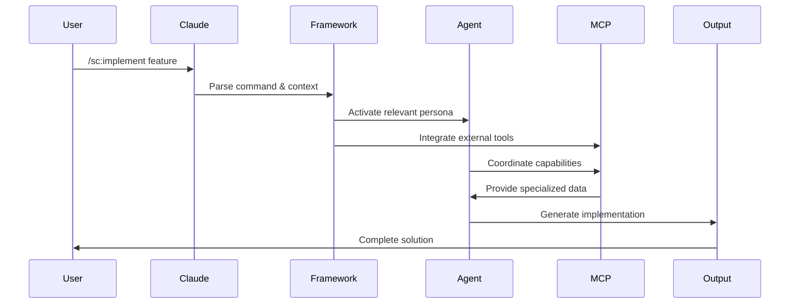
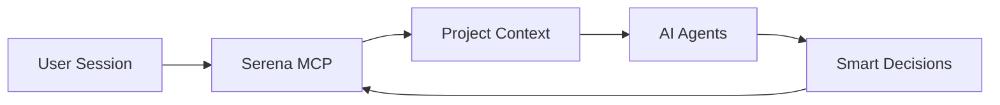

# SuperClaude Framework Component

## 🤖 Overview

The **SuperClaude Framework** is the AI-powered orchestration system that transforms the StudioOps AI platform into an intelligent development and project management environment. It provides specialized AI agents, intelligent commands, behavioral modes, and powerful integrations through the Model Context Protocol (MCP).

### Purpose and Role in StudioOps AI

The SuperClaude Framework serves as the **intelligent layer** that:
- Provides domain-specific AI expertise through specialized agents
- Automates complex development workflows through intelligent commands
- Adapts behavior based on context and task complexity
- Integrates external tools and services through MCP servers
- Maintains project context and memory across sessions

## 🏗️ Architecture Overview

```mermaid
graph TB
    User[👤 User] --> Claude[🧠 Claude Code]
    Claude --> SC[🤖 SuperClaude Framework]
    
    SC --> Agents[🎭 AI Agents<br/>14 Specialists]
    SC --> Commands[⚡ Commands<br/>22 Workflows]
    SC --> Modes[🎯 Behavioral Modes<br/>6 Contexts]
    SC --> MCP[🔌 MCP Servers<br/>6 Integrations]
    
    Agents --> SystemArch[System Architect]
    Agents --> Security[Security Engineer]
    Agents --> Frontend[Frontend Architect]
    Agents --> Backend[Backend Architect]
    
    Commands --> Implement[/sc:implement]
    Commands --> Analyze[/sc:analyze]
    Commands --> Design[/sc:design]
    Commands --> Test[/sc:test]
    
    Modes --> Task[Task Management]
    Modes --> Brainstorm[Brainstorming]
    Modes --> Business[Business Panel]
    
    MCP --> Context7[Context7 MCP]
    MCP --> Magic[Magic MCP]
    MCP --> Sequential[Sequential MCP]
    MCP --> Playwright[Playwright MCP]
```

### How It Integrates with StudioOps AI

The SuperClaude Framework integrates with the StudioOps AI ecosystem through:

1. **API Backend Integration**: AI agents analyze project data and provide intelligent recommendations
2. **Web Frontend Enhancement**: Magic MCP generates UI components and assists with frontend development  
3. **Chrome DevTools Coordination**: Playwright MCP enables browser automation and testing
4. **Document Processing**: Context7 MCP provides up-to-date documentation and patterns
5. **Project Management**: Task Management mode coordinates complex project workflows

## 🎭 AI Agents (14 Specialists)

The framework includes 14 specialized AI agents, each with domain expertise:

### Architecture & System Design Agents

#### **System Architect** 🏗️
- **Purpose**: Design scalable system architecture with focus on maintainability
- **Expertise**: Component boundaries, scalability patterns, dependency management
- **Triggers**: Architecture design needs, technology selection, migration planning
- **Outputs**: Architecture diagrams, design documentation, scalability plans

#### **Backend Architect** ⚙️
- **Purpose**: Design and optimize backend systems and APIs
- **Expertise**: Database design, API patterns, performance optimization
- **Triggers**: Backend design decisions, database optimization, API architecture
- **Outputs**: API specifications, database schemas, backend architecture plans

#### **Frontend Architect** 🎨
- **Purpose**: Design modern, scalable frontend architectures
- **Expertise**: Component architecture, state management, performance optimization
- **Triggers**: Frontend architecture decisions, component design, performance issues
- **Outputs**: Component hierarchies, state management strategies, performance plans

#### **DevOps Architect** 🚀
- **Purpose**: Design deployment and operational infrastructure
- **Expertise**: CI/CD pipelines, containerization, monitoring, scaling
- **Triggers**: Deployment architecture, operational concerns, infrastructure planning
- **Outputs**: Deployment strategies, monitoring setups, operational procedures

### Security & Quality Agents

#### **Security Engineer** 🔒
- **Purpose**: Identify and address security vulnerabilities
- **Expertise**: Security patterns, vulnerability assessment, secure coding
- **Triggers**: Security reviews, vulnerability concerns, authentication design
- **Outputs**: Security assessments, vulnerability reports, security improvements

#### **Quality Engineer** ✅
- **Purpose**: Ensure code quality and testing excellence
- **Expertise**: Testing strategies, code quality metrics, CI/CD quality gates
- **Triggers**: Testing requirements, quality concerns, code review needs
- **Outputs**: Test plans, quality reports, testing frameworks

#### **Performance Engineer** ⚡
- **Purpose**: Optimize application performance and scalability
- **Expertise**: Performance profiling, optimization strategies, bottleneck analysis
- **Triggers**: Performance issues, scalability concerns, optimization requests
- **Outputs**: Performance reports, optimization recommendations, profiling data

### Analysis & Requirements Agents

#### **Requirements Analyst** 📋
- **Purpose**: Analyze and clarify project requirements
- **Expertise**: Requirement gathering, user story creation, acceptance criteria
- **Triggers**: Unclear requirements, feature specifications, project planning
- **Outputs**: Detailed requirements, user stories, acceptance criteria

#### **Root Cause Analyst** 🔍
- **Purpose**: Investigate and diagnose complex technical issues
- **Expertise**: Problem diagnosis, system debugging, investigation methodologies
- **Triggers**: System failures, complex bugs, investigation needs
- **Outputs**: Root cause analysis, investigation reports, resolution plans

### Specialized Development Agents

#### **Python Expert** 🐍
- **Purpose**: Provide expert Python development guidance
- **Expertise**: Python best practices, framework knowledge, optimization
- **Triggers**: Python-specific questions, framework decisions, code optimization
- **Outputs**: Python solutions, best practice recommendations, code reviews

#### **Refactoring Expert** 🔄
- **Purpose**: Improve code structure and maintainability
- **Expertise**: Code refactoring patterns, legacy code improvement, technical debt
- **Triggers**: Code quality issues, refactoring needs, technical debt
- **Outputs**: Refactoring plans, improved code structure, technical debt reduction

#### **Technical Writer** 📝
- **Purpose**: Create clear, comprehensive technical documentation
- **Expertise**: Documentation patterns, API documentation, user guides
- **Triggers**: Documentation needs, API documentation, user guide creation
- **Outputs**: Technical documentation, API docs, user guides

### Educational & Business Agents

#### **Socratic Mentor** 🎓
- **Purpose**: Provide educational guidance through questioning and discovery
- **Expertise**: Teaching methodologies, skill development, mentoring
- **Triggers**: Learning requests, educational needs, skill development
- **Outputs**: Learning paths, educational guidance, skill assessments

#### **Business Panel Experts** 💼
- **Purpose**: Provide multi-expert business analysis and strategic guidance
- **Expertise**: Business strategy, market analysis, financial planning
- **Triggers**: Business decisions, strategic planning, market analysis
- **Outputs**: Business analysis, strategic recommendations, market insights

## ⚡ Commands (22 Workflow Automation)

SuperClaude provides 22 intelligent commands that automate development workflows:

### Core Development Commands

#### **/sc:implement** - Feature Implementation
- **Purpose**: Intelligent feature and code implementation with persona coordination
- **MCP Servers**: Context7, Sequential, Magic, Playwright
- **Personas**: Architect, Frontend, Backend, Security, QA
- **Usage**: `implement user authentication API --type api --safe --with-tests`
- **Outputs**: Complete implementation with testing and documentation

#### **/sc:analyze** - System Analysis
- **Purpose**: Comprehensive analysis of code, architecture, and systems
- **MCP Servers**: Context7, Sequential
- **Usage**: `analyze project structure --depth comprehensive`
- **Outputs**: Analysis reports, recommendations, insights

#### **/sc:design** - System Design
- **Purpose**: Create system designs and architectural plans
- **Personas**: System Architect, Frontend Architect, Backend Architect
- **Usage**: `design user management system --scalability high`
- **Outputs**: Design documents, architecture diagrams, specifications

#### **/sc:test** - Testing Automation
- **Purpose**: Generate and execute comprehensive testing strategies
- **MCP Servers**: Playwright, Sequential
- **Usage**: `test user authentication flow --type e2e`
- **Outputs**: Test suites, test results, coverage reports

### Project Management Commands

#### **/sc:brainstorm** - Ideation and Planning
- **Purpose**: Structured brainstorming and creative problem solving
- **Mode**: Brainstorming Mode activated
- **Usage**: `brainstorm project optimization strategies`
- **Outputs**: Ideas, strategies, actionable plans

#### **/sc:task** - Task Management
- **Purpose**: Create and manage complex task hierarchies
- **Mode**: Task Management Mode activated
- **Usage**: `task implement user dashboard --phases 3`
- **Outputs**: Task hierarchies, progress tracking, deliverables

#### **/sc:workflow** - Process Automation
- **Purpose**: Design and automate development workflows
- **Usage**: `workflow deployment pipeline --env production`
- **Outputs**: Workflow definitions, automation scripts, processes

### Documentation and Communication Commands

#### **/sc:document** - Documentation Generation
- **Purpose**: Create comprehensive documentation
- **Persona**: Technical Writer
- **Usage**: `document API endpoints --format openapi`
- **Outputs**: Technical documentation, API specs, user guides

#### **/sc:explain** - Code and Concept Explanation
- **Purpose**: Provide clear explanations of code and concepts
- **Usage**: `explain authentication middleware --audience junior`
- **Outputs**: Clear explanations, examples, learning materials

### Quality and Improvement Commands

#### **/sc:improve** - Code Improvement
- **Purpose**: Enhance code quality, performance, and maintainability
- **Personas**: Quality Engineer, Performance Engineer, Refactoring Expert
- **Usage**: `improve database queries --focus performance`
- **Outputs**: Improved code, optimization recommendations, refactoring plans

#### **/sc:troubleshoot** - Problem Resolution
- **Purpose**: Diagnose and resolve technical issues
- **Persona**: Root Cause Analyst
- **Usage**: `troubleshoot authentication failures --systematic`
- **Outputs**: Problem diagnosis, resolution steps, prevention strategies

#### **/sc:cleanup** - Code Cleanup
- **Purpose**: Clean and organize codebases
- **Usage**: `cleanup unused imports --scope project`
- **Outputs**: Cleaned code, removed dead code, organized structure

### Specialized Commands

#### **/sc:business-panel** - Business Analysis
- **Purpose**: Multi-expert business analysis and strategic guidance
- **Mode**: Business Panel Mode activated
- **Usage**: `business-panel market entry strategy --industry construction`
- **Outputs**: Business analysis, strategic recommendations, market insights

#### **/sc:estimate** - Project Estimation
- **Purpose**: Estimate time, cost, and resources for projects
- **Usage**: `estimate mobile app development --complexity high`
- **Outputs**: Time estimates, cost analysis, resource requirements

## 🎯 Behavioral Modes (6 Adaptive Contexts)

The framework includes 6 behavioral modes that adapt AI behavior based on context:

### **Task Management Mode** 📋
- **Purpose**: Hierarchical task organization with persistent memory
- **Activation**: Operations with >3 steps, multiple file scopes, complex dependencies
- **Features**: Task hierarchy, memory persistence, progress tracking
- **Memory Operations**: Session state, checkpoints, completion tracking
- **Usage**: Automatically activated for complex multi-step operations

### **Brainstorming Mode** 💡
- **Purpose**: Creative problem-solving and ideation
- **Activation**: Creative challenges, design decisions, innovation needs
- **Features**: Divergent thinking, idea generation, creative exploration
- **Outputs**: Multiple perspectives, innovative solutions, creative alternatives

### **Business Panel Mode** 💼
- **Purpose**: Multi-expert strategic analysis and business insights
- **Activation**: Business decisions, strategic planning, market analysis
- **Features**: Multi-expert consultation, comprehensive analysis, strategic thinking
- **Experts**: Market Analyst, Financial Advisor, Strategy Consultant, Operations Expert

### **Introspection Mode** 🤔
- **Purpose**: Meta-cognitive analysis and self-reflection
- **Activation**: Complex decisions, learning opportunities, process improvement
- **Features**: Self-analysis, decision rationale, learning extraction
- **Outputs**: Decision analysis, learning insights, process improvements

### **Orchestration Mode** 🎼
- **Purpose**: Efficient tool coordination and resource management
- **Activation**: Multi-tool tasks, complex integrations, resource optimization
- **Features**: Tool coordination, resource optimization, workflow efficiency
- **Benefits**: Reduced context switching, optimized tool usage, streamlined workflows

### **Token Efficiency Mode** 🎯
- **Purpose**: Optimize conversation length and context usage
- **Activation**: Long conversations, context limits, efficiency needs
- **Features**: Context compression, efficient communication, memory optimization
- **Benefits**: 30-50% context savings, extended conversation capabilities

## 🔌 MCP Servers (6 Powerful Integrations)

The framework includes 6 MCP servers that provide external tool integration:

### **Context7 MCP** 📚
- **Purpose**: Up-to-date documentation and framework patterns
- **Capabilities**: 
  - Access to latest framework documentation (React, Vue, Angular, etc.)
  - Official API references and best practices
  - Real-time documentation updates
  - Framework-specific code patterns
- **Integration**: Automatic activation based on detected frameworks
- **Usage**: Provides authoritative guidance for framework-specific development

### **Magic MCP** ✨
- **Purpose**: UI component generation and design system integration
- **Capabilities**:
  - Automatic UI component generation
  - Design system integration
  - Component library access
  - Visual design assistance
- **Integration**: Auto-activated for UI development requests
- **Usage**: Generates production-ready UI components with design consistency

### **Sequential MCP** 🔄
- **Purpose**: Complex multi-step analysis and reasoning
- **Capabilities**:
  - Multi-step problem breakdown
  - Complex analysis workflows
  - Sequential reasoning chains
  - Dependency analysis
- **Integration**: Activated for complex analytical tasks
- **Usage**: Handles sophisticated analysis requiring multiple reasoning steps

### **Playwright MCP** 🎭
- **Purpose**: Browser automation and testing
- **Capabilities**:
  - E2E test generation and execution
  - Browser automation scripts
  - Performance testing
  - Visual regression testing
- **Integration**: Integrated with Chrome DevTools MCP
- **Usage**: Provides comprehensive web application testing capabilities

### **Morphllm MCP** 🔄
- **Purpose**: Bulk code transformations and modifications
- **Capabilities**:
  - Large-scale code refactoring
  - Bulk code transformations
  - Pattern-based modifications
  - Code migration assistance
- **Integration**: Activated for large-scale code changes
- **Usage**: Handles complex code transformations across multiple files

### **Serena MCP** 💾
- **Purpose**: Session persistence and project memory
- **Capabilities**:
  - Session state persistence
  - Project context maintenance
  - Long-term memory storage
  - Context restoration
- **Integration**: Always active for memory management
- **Usage**: Maintains project understanding across sessions

## 🔧 Integration with StudioOps AI Components

### API Backend Integration
```python
# Example: AI agent analyzing project data
from SuperClaude.agents import SystemArchitect, SecurityEngineer

# AI provides intelligent recommendations
architect = SystemArchitect()
recommendations = architect.analyze_project_structure(project_data)

# Security analysis for new features
security = SecurityEngineer()
security_report = security.analyze_authentication_flow(auth_code)
```

### Web Frontend Enhancement
```typescript
// Magic MCP generates UI components
// /sc:implement user profile component --framework react
// Results in production-ready React components with proper styling
```

### Document Processing Intelligence
```bash
# Context7 MCP provides framework-specific guidance
/sc:document API endpoints --format openapi --framework fastapi
# Generates comprehensive API documentation following FastAPI conventions
```

### Browser Automation and Testing
```bash
# Playwright MCP integrated testing
/sc:test user authentication flow --type e2e --browser chrome
# Generates and executes comprehensive E2E tests
```

## 📊 Data Flow and Communication

### Command Execution Flow


### Memory and State Management


## 🛠️ Configuration and Setup

### Installation Methods

#### 1. **PyPI Installation (Recommended)**
```bash
# Install SuperClaude
pipx install SuperClaude && pipx upgrade SuperClaude

# Initialize framework
SuperClaude install
```

#### 2. **NPM Installation**
```bash
# Install NPM wrapper
npm install -g @bifrost_inc/superclaude

# Initialize framework
superclaude install
```

#### 3. **Development Setup**
```bash
# Clone and setup for development
git clone https://github.com/SuperClaude-Org/SuperClaude_Framework.git
cd SuperClaude_Framework
pip install -e .
```

### Configuration Files

#### **Claude Desktop Integration**
```json
// ~/.claude.json
{
  "mcpServers": {
    "context7": {
      "command": "python",
      "args": ["path/to/context7/server.py"],
      "env": {"API_KEY": "your_key"}
    },
    "magic": {
      "command": "python", 
      "args": ["path/to/magic/server.py"]
    }
  }
}
```

#### **Framework Configuration**
```yaml
# superclaude.config.yaml
agents:
  enabled: ["system-architect", "security-engineer", "frontend-architect"]
  
commands:
  namespace: "sc"
  auto_persona_activation: true
  
modes:
  default: "task-management"
  auto_detection: true
  
mcp:
  auto_activation: true
  servers: ["context7", "magic", "sequential", "playwright"]
```

## 🔍 Usage Examples for StudioOps AI

### Project Analysis and Planning
```bash
# Analyze current project architecture
/sc:analyze project structure --depth comprehensive --focus scalability

# Design new feature architecture  
/sc:design user dashboard --components data-visualization,real-time-updates --scalability high

# Create project implementation plan
/sc:task implement user management system --phases analysis,design,implementation,testing
```

### AI-Enhanced Development
```bash
# Implement new API endpoint with security validation
/sc:implement project estimation API --type api --safe --with-tests

# Generate UI components with design consistency
/sc:implement project dashboard --type component --framework react --design-system tailwind

# Improve existing code quality
/sc:improve database queries --focus performance --scope project
```

### Business Intelligence and Strategy
```bash
# Analyze market opportunities
/sc:business-panel market analysis --industry construction --focus AI-integration

# Estimate project costs and timeline
/sc:estimate mobile app development --complexity high --team-size 4 --timeline 6-months

# Strategic planning for feature development
/sc:brainstorm feature prioritization --criteria user-impact,development-cost,technical-complexity
```

### Quality Assurance and Testing
```bash
# Comprehensive testing strategy
/sc:test user authentication system --type unit,integration,e2e --coverage 90%

# Security analysis and recommendations
/sc:troubleshoot authentication failures --focus security --systematic

# Code quality improvement
/sc:cleanup technical debt --scope api,frontend --priority high
```

## 🎯 Benefits for StudioOps AI Development

### **Intelligent Development Assistance**
- Context-aware AI agents provide domain-specific expertise
- Automated code generation with best practices
- Intelligent testing and quality assurance
- Real-time documentation and guidance

### **Enhanced Productivity**
- Automated workflow orchestration
- Reduced context switching through intelligent tool coordination
- Persistent project memory across sessions
- Streamlined development processes

### **Quality and Security**
- Built-in security analysis and recommendations
- Comprehensive testing integration
- Code quality enforcement
- Performance optimization guidance

### **Business Intelligence**
- AI-powered project estimation and planning
- Market analysis and strategic guidance
- Resource optimization recommendations
- Data-driven decision support

## 🔧 Troubleshooting and Support

### Common Issues

**Agent not activating:**
```bash
# Check agent availability
/sc:list agents

# Force agent activation
/sc:select-tool system-architect --force
```

**MCP server connection issues:**
```bash
# Check MCP server status
/sc:health mcp-servers

# Restart MCP servers
/sc:restart mcp --server context7
```

**Memory and context issues:**
```bash
# Check session memory
/sc:memory status

# Reset session state
/sc:memory reset --confirm
```

### Performance Optimization

**Optimize context usage:**
- Use Token Efficiency Mode for long conversations
- Leverage memory persistence to reduce repetition
- Enable auto-compression for large contexts

**MCP server optimization:**
- Configure server caching for frequently used data
- Use selective server activation based on task type
- Monitor server performance and resource usage

### Getting Help

1. **Framework Documentation**: Comprehensive guides in `SuperClaude_Framework/Docs/`
2. **Command Reference**: `/sc:help [command]` for specific command guidance
3. **Agent Documentation**: `/sc:help agents` for agent-specific information
4. **MCP Integration**: Check `MCP/` directory for server-specific documentation

The SuperClaude Framework transforms StudioOps AI into an intelligent, AI-enhanced development and project management platform, providing the intelligence layer that makes complex workflows simple and efficient.