# Web Frontend Component

## 🌐 Overview

The **Web Frontend** is a modern React application built with Next.js 14 that provides the user interface for StudioOps AI. It features a bilingual (Hebrew/English) interface, real-time AI chat, and interactive project management tools.

### Purpose and Role in StudioOps AI

The Web Frontend serves as the **primary user interface** that:
- Provides intuitive project management dashboards
- Enables real-time AI interaction through chat interface
- Offers interactive plan editing with live cost calculations
- Supports document upload and processing workflows
- Maintains responsive design for desktop and mobile

## 🏗️ Architecture Overview

```mermaid
graph TB
    User[👤 User] --> Layout[📱 Next.js Layout]
    Layout --> Pages[📄 App Router Pages]
    Layout --> Components[🧩 React Components]
    
    Pages --> Home[🏠 Dashboard]
    Pages --> Projects[📋 Projects]
    Pages --> Chat[💬 AI Chat]
    Pages --> Plans[📊 Plan Editor]
    
    Components --> PlanEditor[📋 Plan Editor]
    Components --> ChatComp[💬 Chat Interface]
    Components --> Forms[📝 Form Components]
    
    Components --> API[🔌 API Backend]
    API --> Database[(🗄️ PostgreSQL)]
```



### Key Technical Stack

- **Framework**: Next.js 14 with App Router
- **UI**: React 18 with TypeScript
- **Styling**: Tailwind CSS with RTL support
- **State**: React Context and hooks
- **HTTP**: Axios for API communication
- **Testing**: Jest + Playwright
- **Languages**: Hebrew (RTL) and English

## 📁 Project Structure

```
apps/web/src/
├── app/                      # Next.js App Router
│   ├── layout.tsx            # Root layout with RTL
│   ├── page.tsx              # Home dashboard
│   ├── projects/             # Project pages
│   ├── chat/                 # AI chat interface
│   └── plans/                # Plan management
├── components/               # React components
│   ├── Chat.tsx              # AI chat interface
│   ├── PlanEditor.tsx        # Interactive plan editor
│   ├── Sidebar.tsx           # Navigation
│   └── ConnectionStatus.tsx  # API status
├── contexts/                 # React contexts
│   └── ThemeContext.tsx      # Theme management
├── hooks/                    # Custom hooks
│   ├── useApi.ts             # API interactions
│   └── useLocalStorage.ts    # Local storage
└── types/                    # TypeScript types
    └── index.ts              # Shared interfaces
```

## 🎨 Design System

### **Bilingual Support (Hebrew/English)**

RTL layout with seamless language switching:

```tsx
// Layout with RTL support
export default function RootLayout({ children }: { children: React.ReactNode }) {
  return (
    <html lang="he" dir="rtl" className="h-full">
      <body className="antialiased bg-background font-sans">
        <ThemeProvider>
          <div className="min-h-screen flex">
            <Sidebar />
            <div className="flex-1 flex flex-col">
              <header className="bg-card border-b h-16">
                <ConnectionStatus />
              </header>
              <main className="flex-1 p-6">{children}</main>
            </div>
          </div>
        </ThemeProvider>
      </body>
    </html>
  )
}
```

### **Theming System**

CSS variable-based theming with dark/light mode:

```css
:root {
  --background: 0 0% 100%;
  --foreground: 222.2 84% 4.9%;
  --primary: 221.2 83.2% 53.3%;
  --border: 214.3 31.8% 91.4%;
}

.dark {
  --background: 222.2 84% 4.9%;
  --foreground: 210 40% 98%;
  --primary: 217.2 91.2% 59.8%;
}
```

### **Typography**

Hebrew/English font system:

```css
.font-sans {
  font-family: 'Rubik', 'Heebo', sans-serif;
}

.font-hebrew {
  font-family: 'Heebo', 'Rubik', sans-serif;
}
```

## 🧩 Core Components

### **Dashboard Page** (`page.tsx`)

Main landing page with quick actions:

```tsx
export default function Home() {
  const [currentPlan, setCurrentPlan] = useState<Plan | null>(null)
  const [showPlanEditor, setShowPlanEditor] = useState(false)

  return (
    <div className="space-y-8">
      {/* Hero Section */}
      <div className="text-center">
        <h1 className="text-4xl md:text-5xl font-bold mb-4">
          ברוכים הבאים ל<span className="gradient-text"> StudioOps AI</span>
        </h1>
        <p className="text-lg text-muted-foreground max-w-3xl mx-auto">
          מערכת ניהול אוטומטית לסטודיו עם בינה מלאכותית
        </p>
      </div>

      {/* Quick Actions Grid */}
      <div className="grid grid-cols-1 md:grid-cols-2 lg:grid-cols-3 gap-6">
        <QuickActionCard 
          icon="📋" 
          title="פרויקט חדש" 
          description="התחל פרויקט חדש עם תכנון אוטומטי"
          onClick={handleNavigateToProjects}
        />
        <QuickActionCard 
          icon="💬" 
          title="שיחה עם AI" 
          description="קבל ייעוץ והמלצות בזמן אמת"
          onClick={handleNavigateToChat}
        />
      </div>

      {/* Main Content Grid */}
      <div className="grid grid-cols-1 lg:grid-cols-2 gap-6">
        <RecentActivity />
        <Chat onPlanSuggest={handlePlanSuggest} onPlanGenerated={handlePlanGenerated} />
      </div>
    </div>
  )
}
```

### **Chat Component** (`Chat.tsx`)

AI-powered real-time chat interface:

```tsx
export default function Chat({ onPlanSuggest, onPlanGenerated }: ChatProps) {
  const [messages, setMessages] = useState<Message[]>([])
  const [input, setInput] = useState('')
  const [isLoading, setIsLoading] = useState(false)

  const handleSend = async () => {
    if (!input.trim() || isLoading) return

    // Add user message
    const userMessage: Message = {
      id: Date.now().toString(),
      text: input,
      isUser: true,
      timestamp: new Date()
    }
    setMessages(prev => [...prev, userMessage])
    setInput('')
    setIsLoading(true)

    try {
      const response = await fetch(`${API_BASE_URL}/chat/message`, {
        method: 'POST',
        headers: { 'Content-Type': 'application/json' },
        body: JSON.stringify({ message: input, project_id: null })
      })

      const data = await response.json()
      
      // Add AI response
      const aiMessage: Message = {
        id: (Date.now() + 1).toString(),
        text: data.message || data.response,
        isUser: false,
        timestamp: new Date(),
        data: data
      }
      setMessages(prev => [...prev, aiMessage])

      // Check for plan suggestions
      if (data.suggests_plan && onPlanSuggest) {
        onPlanSuggest(true)
      }
    } catch (error) {
      // Error handling with user-friendly message
      setMessages(prev => [...prev, {
        id: (Date.now() + 1).toString(),
        text: 'בעיה בחיבור לשרת. בדוק את החיבור.',
        isUser: false,
        timestamp: new Date()
      }])
    } finally {
      setIsLoading(false)
    }
  }

  return (
    <div className="flex flex-col h-full">
      {/* Messages Area */}
      <div className="flex-1 overflow-y-auto p-6 space-y-4">
        {messages.map((message) => (
          <div key={message.id} className={`flex ${message.isUser ? 'justify-start' : 'justify-end'}`}>
            <div className={`max-w-md px-5 py-4 rounded-2xl ${
              message.isUser 
                ? 'bg-primary text-primary-foreground shadow-lg'
                : 'bg-muted/80 text-foreground border shadow-sm'
            }`}>
              <p className="text-sm leading-relaxed">{message.text}</p>
              <p className="text-xs opacity-60 mt-3">
                {message.timestamp.toLocaleTimeString('he-IL')}
              </p>
            </div>
          </div>
        ))}
      </div>

      {/* Input Area */}
      <div className="border-t p-6">
        <div className="flex space-x-3 space-x-reverse">
          <input
            type="text"
            value={input}
            onChange={(e) => setInput(e.target.value)}
            onKeyPress={(e) => e.key === 'Enter' && handleSend()}
            placeholder="הקלד את ההודעה שלך..."
            className="input flex-1"
          />
          <button
            onClick={handleSend}
            disabled={isLoading || !input.trim()}
            className="btn btn-primary px-6"
          >
            📤 שלח
          </button>
        </div>
      </div>
    </div>
  )
}
```

**Chat Features:**
- Real-time messaging with typing indicators
- Context-aware AI responses
- Plan suggestion detection
- Bilingual support
- Error handling with user feedback

### **Plan Editor Component** (`PlanEditor.tsx`)

Interactive plan editing with live calculations:

```tsx
export default function PlanEditor({ plan, onPlanChange }: PlanEditorProps) {
  const [localPlan, setLocalPlan] = useState<Plan>(plan)
  const [editingCell, setEditingCell] = useState<{ rowIndex: number; field: string } | null>(null)

  const handleCellBlur = () => {
    if (editingCell && editValue !== '') {
      const { rowIndex, field } = editingCell
      const updatedItems = [...localPlan.items]
      
      // Handle numeric fields with real-time calculation
      if (field === 'quantity' || field === 'unit_price') {
        const numericValue = parseFloat(editValue)
        if (!isNaN(numericValue)) {
          updatedItems[rowIndex] = {
            ...updatedItems[rowIndex],
            [field]: numericValue,
            subtotal: field === 'quantity' 
              ? numericValue * updatedItems[rowIndex].unit_price
              : updatedItems[rowIndex].quantity * numericValue
          }
        }
      }

      // Recalculate total
      const updatedPlan = {
        ...localPlan,
        items: updatedItems,
        total: updatedItems.reduce((sum, item) => sum + item.subtotal, 0)
      }

      setLocalPlan(updatedPlan)
      onPlanChange(updatedPlan)
    }
    setEditingCell(null)
  }

  return (
    <div className="bg-background/95 backdrop-blur-sm rounded-xl border shadow-xl">
      {/* Header with Summary */}
      <div className="px-8 py-6 border-b">
        <h3 className="text-2xl font-semibold mb-2">עורך תוכנית - {localPlan.project_name}</h3>
        <p className="text-sm text-muted-foreground">
          סך הכל: <span className="font-semibold">{formatCurrency(localPlan.total)}</span> |
          {localPlan.items.length} פריטים
        </p>
      </div>

      {/* Editable Table */}
      <div className="overflow-x-auto">
        <table className="w-full border-collapse">
          <thead>
            <tr className="bg-muted/50">
              <th className="px-6 py-4 text-right">קטגוריה</th>
              <th className="px-6 py-4 text-right">תיאור</th>
              <th className="px-6 py-4 text-right">כמות</th>
              <th className="px-6 py-4 text-right">מחיר ליחידה</th>
              <th className="px-6 py-4 text-right">סה"כ</th>
            </tr>
          </thead>
          <tbody>
            {localPlan.items.map((item, index) => (
              <tr key={index} className="hover:bg-muted/20 transition-colors">
                {/* Inline editing cells */}
                <EditableCell 
                  value={item.category}
                  onEdit={(value) => handleCellEdit(index, 'category', value)}
                />
                <EditableCell 
                  value={item.title}
                  onEdit={(value) => handleCellEdit(index, 'title', value)}
                />
                {/* Additional cells... */}
              </tr>
            ))}
          </tbody>
        </table>
      </div>
    </div>
  )
}
```

**Plan Editor Features:**
- Inline editing with click-to-edit cells
- Real-time cost calculations
- Category dropdown selection
- Add/remove rows dynamically
- Currency formatting (NIS)
- Responsive table design

## 🔄 State Management

### **Theme Context**

```tsx
interface ThemeContextType {
  theme: 'light' | 'dark'
  toggleTheme: () => void
}

export function ThemeProvider({ children }: { children: React.ReactNode }) {
  const [theme, setTheme] = useState<Theme>('light')

  useEffect(() => {
    // Load saved theme or use system preference
    const savedTheme = localStorage.getItem('theme') as Theme
    const systemPrefersDark = window.matchMedia('(prefers-color-scheme: dark)').matches
    const initialTheme = savedTheme || (systemPrefersDark ? 'dark' : 'light')
    
    setTheme(initialTheme)
    document.documentElement.classList.toggle('dark', initialTheme === 'dark')
  }, [])

  const toggleTheme = () => {
    const newTheme = theme === 'light' ? 'dark' : 'light'
    setTheme(newTheme)
    localStorage.setItem('theme', newTheme)
    document.documentElement.classList.toggle('dark', newTheme === 'dark')
  }

  return (
    <ThemeContext.Provider value={{ theme, toggleTheme }}>
      {children}
    </ThemeContext.Provider>
  )
}
```

### **Custom Hooks**

**API Hook:**
```tsx
export function useApi() {
  const [loading, setLoading] = useState(false)
  const [error, setError] = useState<string | null>(null)

  const request = useCallback(async <T>(url: string, options: RequestInit = {}): Promise<T> => {
    setLoading(true)
    setError(null)

    try {
      const response = await fetch(`${API_BASE_URL}${url}`, {
        headers: { 'Content-Type': 'application/json', ...options.headers },
        ...options,
      })

      if (!response.ok) throw new Error(`HTTP error! status: ${response.status}`)
      return await response.json()
    } catch (err) {
      const errorMessage = err instanceof Error ? err.message : 'An error occurred'
      setError(errorMessage)
      throw err
    } finally {
      setLoading(false)
    }
  }, [])

  return { request, loading, error }
}
```

## 🌐 API Integration

### **Configuration**

```typescript
// lib/api.ts
export const API_BASE_URL = process.env.NEXT_PUBLIC_API_URL || 'http://localhost:8000'

export const apiClient = {
  get: async <T>(url: string): Promise<T> => {
    const response = await fetch(`${API_BASE_URL}${url}`)
    if (!response.ok) throw new Error(`HTTP error! status: ${response.status}`)
    return response.json()
  },
  
  post: async <T>(url: string, data: any): Promise<T> => {
    const response = await fetch(`${API_BASE_URL}${url}`, {
      method: 'POST',
      headers: { 'Content-Type': 'application/json' },
      body: JSON.stringify(data)
    })
    if (!response.ok) throw new Error(`HTTP error! status: ${response.status}`)
    return response.json()
  }
}
```

### **Connection Monitoring**

```tsx
export default function ConnectionStatus() {
  const [status, setStatus] = useState<'connected' | 'disconnected' | 'checking'>('checking')
  
  useEffect(() => {
    const checkConnection = async () => {
      try {
        const response = await fetch(`${API_BASE_URL}/health`)
        setStatus(response.ok ? 'connected' : 'disconnected')
      } catch {
        setStatus('disconnected')
      }
    }

    checkConnection()
    const interval = setInterval(checkConnection, 30000)
    return () => clearInterval(interval)
  }, [])

  return (
    <div className="flex items-center space-x-2 space-x-reverse">
      <div className={`w-2 h-2 rounded-full ${
        status === 'connected' ? 'bg-green-500 animate-pulse' :
        status === 'disconnected' ? 'bg-red-500' : 'bg-yellow-500'
      }`} />
      <span className="text-sm text-muted-foreground">
        {status === 'connected' ? 'מחובר' : status === 'disconnected' ? 'מנותק' : 'בודק...'}
      </span>
    </div>
  )
}
```

## 🧪 Testing

### **Unit Tests (Jest)**

```typescript
import { render, screen, fireEvent } from '@testing-library/react'
import Chat from '../Chat'

describe('Chat Component', () => {
  test('sends message correctly', async () => {
    const mockOnPlanSuggest = jest.fn()
    render(<Chat onPlanSuggest={mockOnPlanSuggest} />)
    
    const input = screen.getByPlaceholderText('הקלד את ההודעה שלך...')
    const sendButton = screen.getByText('שלח')
    
    fireEvent.change(input, { target: { value: 'Test message' } })
    fireEvent.click(sendButton)
    
    expect(screen.getByText('Test message')).toBeInTheDocument()
  })
})
```

### **E2E Tests (Playwright)**

```typescript
import { test, expect } from '@playwright/test'

test('complete chat workflow', async ({ page }) => {
  await page.goto('/')
  await page.click('[data-testid="chat-tab"]')
  await page.fill('[data-testid="chat-input"]', 'Hello AI')
  await page.click('[data-testid="send-button"]')
  await expect(page.locator('[data-testid="ai-response"]')).toBeVisible()
})
```

## 📱 Responsive Design

### **Mobile-First Approach**

```css
/* Responsive grid system */
.responsive-grid {
  @apply grid grid-cols-1 md:grid-cols-2 lg:grid-cols-3 gap-4;
}

/* Touch-friendly interactions */
.touch-target {
  @apply min-h-12 min-w-12 p-3;
}

/* Mobile optimizations */
@screen sm {
  .mobile-hidden { @apply hidden; }
}
```

### **Accessibility Features**

- **Keyboard Navigation**: Full keyboard support
- **Screen Reader**: ARIA labels and semantic HTML
- **Color Contrast**: WCAG compliant ratios
- **RTL Support**: Proper bidirectional text
- **Touch Targets**: Minimum 44px targets

## 🚀 Performance

### **Next.js Optimizations**

- **App Router**: Server components for faster loading
- **Image Optimization**: Next.js Image component
- **Bundle Splitting**: Automatic code splitting
- **Streaming**: React Server Components

### **React Optimizations**

- **Memoization**: useMemo and useCallback
- **Lazy Loading**: Component-level code splitting  
- **Debouncing**: Input debouncing for API calls

### **CSS Optimizations**

- **Tailwind JIT**: Just-in-time compilation
- **Font Optimization**: Web font loading strategies
- **Asset Compression**: Optimized images and assets

## 🔧 Configuration

```bash
# .env.local
NEXT_PUBLIC_API_URL=http://localhost:8000
NEXT_PUBLIC_ENABLE_MOCK_DATA=false
NEXT_PUBLIC_DEBUG_MODE=true
```

## 🎯 Key Features

### **User Experience**
- **Bilingual Interface**: Hebrew (RTL) and English
- **Real-time AI Chat**: Context-aware responses
- **Interactive Plan Editor**: Live calculations
- **Responsive Design**: Mobile-first approach
- **Dark/Light Themes**: System preference support

### **Technical Features**
- **Type Safety**: Full TypeScript implementation
- **Modern React**: Hooks and functional components
- **Performance**: Next.js 14 optimizations
- **Testing**: Unit and E2E test coverage
- **Accessibility**: WCAG compliant design

The Web Frontend provides an intuitive, responsive interface that makes complex project management simple while maintaining high performance and accessibility standards.