# Chrome DevTools MCP Component

## 🔧 Overview

The **Chrome DevTools MCP** is a Model Context Protocol (MCP) server that provides Chrome DevTools Protocol integration, enabling AI-powered web application debugging and browser automation directly through Claude Desktop and SuperClaude Framework.

### Purpose and Role in StudioOps AI

The Chrome DevTools MCP serves as the **browser automation and debugging layer** that:
- Connects AI agents to live web applications for real-time debugging
- Provides automated testing capabilities through Playwright integration
- Enables performance monitoring and analysis of web applications
- Offers DOM inspection and JavaScript execution in browser context
- Facilitates network traffic monitoring and API debugging

## 🏗️ Architecture Overview

```mermaid
graph TB
    Claude[🧠 Claude Desktop] --> MCP[🔧 Chrome DevTools MCP]
    SuperClaude[🤖 SuperClaude Framework] --> MCP
    
    MCP --> Chrome[🌐 Chrome Browser]
    MCP --> CDP[📡 Chrome DevTools Protocol]
    
    Chrome --> WebApp[🌐 StudioOps Web App]
    CDP --> Network[🌐 Network Monitor]
    CDP --> Console[💻 Console Access]
    CDP --> DOM[🏗️ DOM Inspector]
    CDP --> Performance[⚡ Performance Monitor]
    
    MCP --> Playwright[🎭 Playwright Integration]
    Playwright --> E2E[🧪 E2E Testing]
    
    Network --> APIDebug[🔍 API Debugging]
    Console --> ErrorTrack[❌ Error Tracking]
    Performance --> Metrics[📊 Performance Metrics]
```



### Key Integration Points

**With SuperClaude Framework:**
- **Playwright MCP Server**: Integrated testing and automation
- **Magic MCP**: UI component validation and testing
- **Sequential MCP**: Complex multi-step browser automation

**With StudioOps AI Components:**
- **Web Frontend**: Direct debugging and performance monitoring
- **API Backend**: Network request analysis and API testing
- **End-to-End Testing**: Complete user workflow validation

## 🛠️ Core Capabilities

### **Browser Management**

**Chrome Instance Control:**
```python
# Start Chrome with debugging enabled
start_chrome(port=9222, url="localhost:3000", headless=False, auto_connect=True)

# Connect to existing Chrome instance
connect_to_browser(port=9222)

# Navigate to specific URL
navigate_to_url("http://localhost:3000/projects")

# Check connection status
get_connection_status()
```

**One-Step Setup:**
```python
# Start Chrome, connect, and navigate in one command
start_chrome_and_connect("localhost:3000")
```

### **Network Monitoring and API Debugging**

**Request Analysis:**
```python
# Monitor all network requests
get_network_requests()

# Filter requests by domain or status
get_network_requests(filter_domain="localhost:8000", filter_status=500)

# Get detailed response data
get_network_response(request_id="123")
```

**Real-time Network Monitoring:**
- HTTP request/response capture
- API endpoint performance analysis
- Failed request identification
- Response header and payload inspection

### **Console Integration and Error Tracking**

**Console Operations:**
```python
# Get console logs with filtering
get_console_logs(level="error", limit=50)

# Get organized error summary
get_console_error_summary()

# Execute JavaScript in browser context
execute_javascript("window.location.href")

# Inspect JavaScript objects
inspect_console_object("window.myApp")

# Real-time console monitoring
monitor_console_live(duration_seconds=30)
```

**Error Analysis Features:**
- JavaScript error tracking and categorization
- Stack trace analysis
- Runtime error monitoring
- Console warning and info aggregation

### **Performance Monitoring**

**Performance Metrics:**
```python
# Get comprehensive page performance
get_page_info()

# Detailed performance metrics
get_performance_metrics()

# Resource loading analysis
get_performance_metrics()
```

**Performance Data Includes:**
- Page load times and rendering metrics
- Resource loading analysis (scripts, styles, images)
- Memory usage and optimization opportunities
- Core Web Vitals (LCP, FID, CLS)

### **DOM Inspection and Manipulation**

**DOM Analysis:**
```python
# Get document structure
get_document(depth=3, pierce=True)

# Query specific elements
query_selector(node_id, "button.primary")
query_selector_all(node_id, ".error-message")

# Get element details
get_element_attributes(node_id)
get_element_outer_html(node_id)
describe_element(node_id, depth=2)

# Element positioning
get_element_at_position(x=100, y=200)
get_element_box_model(node_id)
```

**CSS and Styling Analysis:**
```python
# Style inspection
get_computed_styles(node_id)
get_inline_styles(node_id)
get_matched_styles(node_id)

# CSS coverage analysis
start_css_coverage_tracking()
css_coverage = stop_css_coverage_tracking()
```

### **Storage and Data Management**

**Browser Storage:**
```python
# Cookie management
get_all_cookies()
get_cookies(domain="localhost:3000")
set_cookie(name="auth_token", value="abc123", domain="localhost:3000")
clear_all_cookies()

# Storage quota and usage
get_storage_usage_and_quota("http://localhost:3000")
clear_storage_for_origin("http://localhost:3000", ["localStorage", "sessionStorage"])
```

## 🎭 Playwright Integration

### **End-to-End Testing**

**Test Generation and Execution:**
```python
# Automated E2E test generation
generate_e2e_test(user_flow="login -> create project -> add plan items")

# Execute existing tests
run_playwright_test(test_file="auth.spec.ts")

# Visual regression testing
take_screenshot(element_selector=".dashboard")
compare_screenshots(baseline="dashboard-baseline.png")
```

**Testing Capabilities:**
- User flow automation and validation
- Form interaction and submission testing
- Navigation and routing verification
- Visual regression testing
- Performance testing under load

### **Browser Automation**

**Complex Workflow Automation:**
```python
# Multi-step user workflows
automate_user_flow([
    "navigate_to('http://localhost:3000')",
    "click_button('.login-btn')",
    "fill_input('#username', 'admin')",
    "fill_input('#password', 'password')",
    "click_button('#login-submit')",
    "wait_for_selector('.dashboard')",
    "take_screenshot('login-success.png')"
])
```

## 🔌 MCP Server Architecture

### **Server Implementation**

```python
# MCP Server registration and capabilities
from mcp import MCPServer
from chrome_devtools import ChromeDevToolsProtocol

class ChromeDevToolsMCP(MCPServer):
    def __init__(self):
        super().__init__(name="chrome-devtools")
        self.cdp = ChromeDevToolsProtocol()
        
    async def start_chrome_and_connect(self, url: str, port: int = 9222) -> dict:
        """Start Chrome with debugging and connect to application"""
        try:
            # Start Chrome with remote debugging
            chrome_process = await self.start_chrome(
                port=port, 
                url=url, 
                headless=False,
                auto_connect=True
            )
            
            # Connect to CDP
            await self.cdp.connect(f"http://localhost:{port}")
            
            # Navigate to application
            await self.cdp.navigate(url)
            
            return {
                "status": "connected",
                "chrome_pid": chrome_process.pid,
                "debug_url": f"http://localhost:{port}",
                "application_url": url
            }
        except Exception as e:
            return {"status": "error", "message": str(e)}
```

### **Tool Registration**

```python
# Register MCP tools for Claude Desktop
@mcp.tool("start_chrome_and_connect")
async def start_chrome_and_connect(url: str, port: int = 9222) -> dict:
    """Start Chrome with debugging enabled and connect to application"""
    return await chrome_mcp.start_chrome_and_connect(url, port)

@mcp.tool("get_network_requests") 
async def get_network_requests(filter_domain: str = None, filter_status: int = None) -> list:
    """Get network requests with optional filtering"""
    return await chrome_mcp.get_network_requests(filter_domain, filter_status)

@mcp.tool("get_console_error_summary")
async def get_console_error_summary() -> dict:
    """Get organized summary of console errors and warnings"""
    return await chrome_mcp.get_console_error_summary()
```

## 🚀 Usage Workflows for StudioOps AI

### **Frontend Development and Debugging**

**Development Workflow:**
```bash
# 1. Start StudioOps web application
cd apps/web && npm run dev

# 2. Connect Chrome DevTools MCP to running application
start_chrome_and_connect("localhost:3000")

# 3. Monitor for errors during development
get_console_error_summary()

# 4. Test specific features
navigate_to_url("localhost:3000/projects")
execute_javascript("document.querySelector('.project-card').click()")

# 5. Monitor API calls
get_network_requests(filter_domain="localhost:8000")
```

**Error Investigation:**
```bash
# Monitor console for JavaScript errors
monitor_console_live(30)

# Get network failures
get_network_requests(filter_status=500)

# Inspect specific elements causing issues
query_selector_all(document_node, ".error-message")
```

### **API Testing and Integration**

**API Workflow Testing:**
```bash
# Test complete user workflow
start_chrome_and_connect("localhost:3000")

# Navigate through application
navigate_to_url("localhost:3000/projects")
execute_javascript("document.querySelector('.new-project-btn').click()")

# Monitor API calls during form submission
get_network_requests(filter_domain="localhost:8000")

# Verify response data
get_network_response(request_id="create-project-123")
```

### **Performance Analysis**

**Performance Monitoring:**
```bash
# Load application and measure performance
start_chrome_and_connect("localhost:3000")

# Get comprehensive performance metrics
get_page_info()
get_performance_metrics()

# Analyze resource loading
get_network_requests()

# Monitor memory usage
execute_javascript("performance.memory")
```

### **End-to-End Testing**

**Automated Testing Workflow:**
```bash
# Generate tests for user workflows
generate_e2e_test("user creates project and adds plan items")

# Execute comprehensive test suite
run_playwright_test("projects.spec.ts")

# Visual regression testing
take_screenshot(".dashboard")
compare_screenshots("dashboard-baseline.png")
```

## 🔧 Installation and Configuration

### **MCP CLI Installation**

```bash
# Clone repository
git clone https://github.com/benjaminr/chrome-devtools-mcp.git
cd chrome-devtools-mcp

# Install dependencies
pip install -r requirements.txt

# Install via MCP CLI
mcp install server.py -n "Chrome DevTools MCP" --with-editable .
```

### **Claude Desktop Configuration**

```json
{
  "mcpServers": {
    "chrome-devtools": {
      "command": "python",
      "args": ["/absolute/path/to/chrome-devtools-mcp/server.py"],
      "env": {
        "CHROME_DEBUG_PORT": "9222"
      }
    }
  }
}
```

### **Environment Variables**

```bash
# Chrome debugging port
CHROME_DEBUG_PORT=9222

# Chrome executable path (optional)
CHROME_PATH=/path/to/chrome

# Debug mode
DEBUG_MODE=true
```

## 🔍 Troubleshooting

### **Common Issues**

**Chrome won't start:**
```bash
# Check Chrome executable path
which google-chrome

# Verify port availability
netstat -an | grep 9222

# Start Chrome manually for testing
google-chrome --remote-debugging-port=9222 --no-first-run
```

**Connection issues:**
```bash
# Check connection status
get_connection_status()

# Restart connection
disconnect_from_browser()
connect_to_browser(port=9222)
```

**Performance issues:**
```bash
# Check Chrome process resources
ps aux | grep chrome

# Monitor memory usage
execute_javascript("performance.memory")
```

## 🧪 Testing and Validation

### **MCP Server Testing**

```python
# Test MCP server functionality
async def test_chrome_devtools_mcp():
    # Test Chrome startup
    result = await start_chrome_and_connect("localhost:3000")
    assert result["status"] == "connected"
    
    # Test network monitoring
    requests = await get_network_requests()
    assert isinstance(requests, list)
    
    # Test console access
    logs = await get_console_logs()
    assert "logs" in logs
    
    # Test DOM inspection
    doc = await get_document()
    assert "nodeId" in doc
```

### **Integration Testing**

```bash
# Test complete StudioOps AI integration
start_chrome_and_connect("localhost:3000")

# Test project creation workflow
navigate_to_url("localhost:3000/projects")
execute_javascript("document.querySelector('.new-project-btn').click()")

# Verify API integration
get_network_requests(filter_domain="localhost:8000")

# Test chat functionality
navigate_to_url("localhost:3000/chat")
execute_javascript("document.querySelector('#chat-input').value = 'Test message'")
```

## 📊 Performance and Monitoring

### **Resource Usage**

- **Memory**: ~50-100MB per Chrome instance
- **CPU**: Minimal impact during idle, moderate during active debugging
- **Network**: Local connections only (no external traffic)

### **Security Considerations**

- **Local Only**: Connections restricted to localhost
- **Development Mode**: Not for production environments
- **Process Isolation**: Chrome runs in separate process
- **No Data Persistence**: Session-based debugging only

## 🎯 Benefits for StudioOps AI

### **Development Acceleration**

- **Real-time Debugging**: Immediate error identification and resolution
- **Performance Optimization**: Live performance monitoring and analysis
- **API Testing**: Direct API endpoint testing and validation
- **User Experience Validation**: Interactive testing of user workflows

### **Quality Assurance**

- **Automated Testing**: E2E test generation and execution
- **Visual Regression**: Automated UI change detection
- **Error Tracking**: Comprehensive error monitoring and analysis
- **Performance Benchmarking**: Consistent performance measurement

### **AI-Enhanced Development**

- **Intelligent Debugging**: AI-powered error analysis and suggestions
- **Automated Testing**: AI-generated test scenarios
- **Performance Insights**: AI-driven performance optimization recommendations
- **Workflow Automation**: Intelligent browser automation

The Chrome DevTools MCP component provides powerful browser automation and debugging capabilities that significantly enhance the development and testing experience for StudioOps AI, enabling real-time application analysis and AI-powered development assistance.